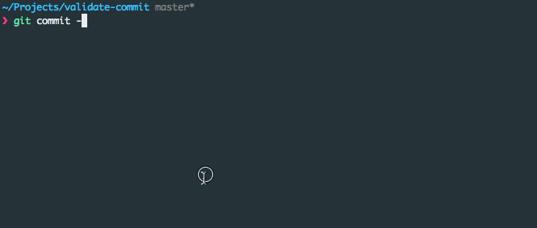

# validate-commit

[![NPM version][npm-image]][npm-url]
[![Build Status][travis-image]][travis-url]
[![Coveralls Status][coveralls-image]][coveralls-url]
[![Dependency Status][depstat-image]][depstat-url]
[![Downloads][download-badge]][npm-url]

> Validate Angular style commit messages

## Install

```sh
npm i validate-commit --save-dev
```

## Description

Even though there are a couple of other packages that do this, I wanted to release this one with a few quality of life changes.

- Uses [Chalk](https://www.npmjs.com/package/chalk) to color messages
- Outputs all the <scopes> when the scope is incorrect

## Example



## Usage

### Git Hook

Using [git-scripts](https://www.npmjs.com/package/git-scripts)

```json
"git": {
    "scripts": {
        "commit-msg": "./node_modules/.bin/validate-commit-msg $1"
    }
}
```

### CLI

```bash
$ validate-commit-msg 'chore(package): some message'
```

### Module

```js
var validateCommit = require('validate-commit');

validateCommit('chore(package): some message'); // true
```

## License

Apache-2.0 © [Will Soto](http://github.com/paradox41)

[npm-url]: https://npmjs.org/package/validate-commit
[npm-image]: https://img.shields.io/npm/v/validate-commit.svg?style=flat-square

[travis-url]: https://travis-ci.org/paradox41/validate-commit
[travis-image]: https://img.shields.io/travis/paradox41/validate-commit.svg?style=flat-square

[coveralls-url]: https://coveralls.io/r/paradox41/validate-commit
[coveralls-image]: https://img.shields.io/coveralls/paradox41/validate-commit.svg?style=flat-square

[depstat-url]: https://david-dm.org/paradox41/validate-commit
[depstat-image]: https://david-dm.org/paradox41/validate-commit.svg?style=flat-square

[download-badge]: http://img.shields.io/npm/dm/validate-commit.svg?style=flat-square
